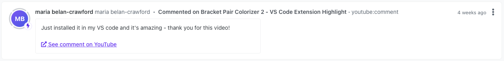
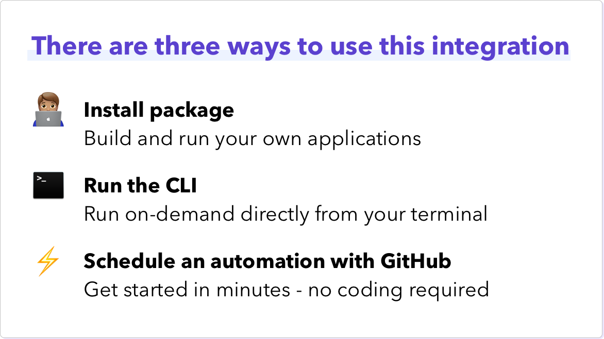

# YouTube to Orbit Workspace


[](https://badge.fury.io/js/%40orbit-love%2Fyoutube)
[](.github/CODE_OF_CONDUCT.md)

This is a JavaScript package that can be used to integrate YouTube comments from videos uploaded to a specified channel into your organization's Orbit workspace.



|<p align="left">:sparkles:</p> This is a *community project*. The Orbit team does its best to maintain it and keep it up to date with any recent API changes.<br/><br/>We welcome community contributions to make sure that it stays current. <p align="right">:sparkles:</p>|
|-----------------------------------------|



## First Time Setup

To set up this integration you will need some details from YouTube.

1. Create a project in the [Google Developers Console](https://console.developers.google.com/)
2. After creating your project, make sure the YouTube Data API is one of the services that your application is registered to use.
3. Go to the Credentials area of your application and create an API Key. Take note of the API Key as it will only be shown once.
4. Get your Channel's ID by [following these steps](https://support.google.com/youtube/answer/3250431).

## Application Credentials

The application requires the following environment variables:

| Variable | Description | More Info
|---|---|--|
| `YOUTUBE_API_KEY` | Allows you to use the YouTube Data API | Follow the guide above
| `YOUTUBE_CHANNEL_ID` | The ID of the channel you want to scan for comments | Follow the guide above
| `ORBIT_API_KEY` | API key for Orbit | Found in `Account Settings` in your Orbit workspace
| `ORBIT_WORKSPACE_ID` | ID for your Orbit workspace | Last part of the Orbit workspace URL, i.e. `https://app.orbit.love/my-workspace`, the ID is `my-workspace`

## Notes about quota

Please take a moment to read the [quota usage](https://developers.google.com/youtube/v3/getting-started#quota) section of the YouTube Data API documentation. Per request this application:

- makes one list channel request
- makes one list videos request for every 50 videos on your channel
- makes one list commentThread request for every video with at least one comment

This should be fine for a majority of channels, but if you are concerned you will exceed the quota follow the provided guide on how to request a quota increase.

## Package Usage

Install the package with the following command

```
$ npm install @orbit-love/youtube
```

Use the package with the following snippet.

```js
const OrbitYouTube = require('@orbit-love/youtube')
const orbitYouTube = new OrbitYouTube()

// Allows you to go back a number of hours and only get comments in that timeframe
const videos = await orbitYouTube.getComments({ channelId: YOUTUBE_CHANNEL_ID, hours: 24 })
const comments = await orbitYouTube.prepareComments(videos)
const response = await orbitYouTube.addActivities(comments)
console.log(response) // "Added n activities to the workspace-id Orbit workspace"
```

The standard initialization of the library requires the following signature:

```js
const OrbitYouTube = require('@orbit-love/youtube')
const orbitYouTube = new OrbitYouTube('orbitWorkspaceId', 'orbitApiKey', 'ytApiKey', 'ytChannelId')
```

If you have the following environment variables set: `ORBIT_WORKSPACE_ID`, `ORBIT_API_KEY`, `YOUTUBE_API_KEY`, and `YOUTUBE_CHANNEL_ID` then you can initialize the client as follows:

```js
const OrbitYouTube = require('@orbit-love/youtube')
const orbitYouTube = new OrbitYouTube()
```

## CLI Usage

To use this package you do not need to install it, but will need Node.js installed on your machine.

```
npx @orbit-love/youtube --comments
```

By default this will get the last 24 hours worth of activity, but this can be explicitly overridden:

```
npx @orbit-love/youtube --comments--hours=24
```

If you have set the `YOUTUBE_CHANNEL_ID` environment variable we will use this. If you want to be explicit you can provide it explicitly:

```
npx @orbit-love/youtube --comments --channel=id
```

To use the CLI you must have the following environment variables set: `ORBIT_WORKSPACE_ID`, `ORBIT_API_KEY`, `YOUTUBE_API_KEY`.

## GitHub Actions Automation Setup

⚡ You can set up this integration in a matter of minutes using our GitHub Actions template. It will run regularly to add new activities to your Orbit workspace. All you need is a GitHub account.

[See our guide for setting up this automation](https://github.com/orbit-love/github-actions-templates/blob/main/YouTube/README.md)

## Contributing

We 💜 contributions from everyone! Check out the [Contributing Guidelines](.github/CONTRIBUTING.md) for more information.

## License

This project is under the [MIT License](./LICENSE).

## Code of Conduct

This project uses the [Contributor Code of Conduct](.github/CODE_OF_CONDUCT.md). We ask everyone to please adhere by its guidelines.
